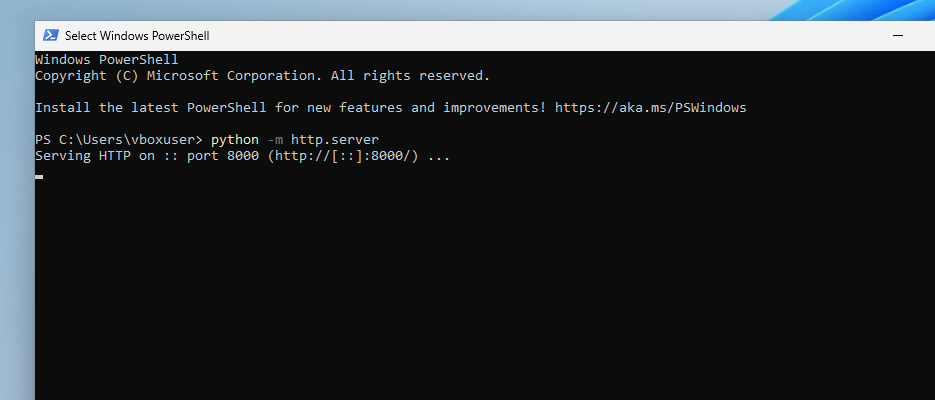

 

Attack Analysis: Using Elastic

This attack analysis is part of a Detection Engineering project using Elastic Security. The attack simulation involves hosting a Python web server using PowerShell on a target machine.

Tools used:
Target Machine - Windows 11 machine
Attacker Machine - Parrot OS
Tool used by attacker - Nmap, Nikto and ZAP
Log analysis tool - Elastic and Zeek

Steps for simulating and analysing the attack:

Step 1: Start Zeek in ubuntu machine.
Ensure it should be running.
Refer to 

Step 2 : On the Windows 11 machine, Open Powershell and run the below command to run the web server
> python -m http.server

This will give all the active and running ports
Refer to 

Step 3: Create a test file in a PowerShell window(another window)
> echo "test file" > *filename*
> cat *filename*
Refer to 

Step 4: Access the Web server from Parrot OS
In Parrot OS, open a browser and navigate to the Windows 11 machine’s IP address with the specified port.
This will display the "Directory listings." Refer to 

Logs will also be shown in the PowerShell window where the server is running.
Refer to 

Step 5: In Elastic, with Zeek running, use the following query in Discover:
event.dataset:zeek.http 
The PowerShell logs will appear. We can customize the columns and view the additional details.

Step 6: Run Nmap from Parrot OS
> sudo nmap -sV -p *port_number* *target ip*
Refer to 

Step 7: Run Nikto from Parrot OS
> sudo nikto -h *target ip:port_number*
Refer to 

Step 8: Perform OWASP-ZAP Scan
In Parrot OS, go to Applications -> Pentesting Tools -> Most Used Tools -> OWASP-ZAP
In OWASP-ZAP, Quick Start -> Automated scan -> Enter the url -> Attack -> See the logs
Refer to 
Check various modules shown below.

Logs can also be viewed in the PowerShell window on the Windows 11 machine. 
Refer to 

Alert creation in Elastic:

In Discover, use the following query to see logs related to Nmap, Nikto, and OWASP-ZAP activities:
"event.dataset:zeek.http"
See all the logs about the nmap, nikto, OWASP scanner and all the activities.

Rule creation:

1. To generate alerts for both Nmap and Nikto activity:
Refer to 

2. Go to Security -> Alerts -> Rules -> Create new Rules
3. Choose Custom query 
Below is the query
event.dataset:zeek.http and user_agent.original:*Nmap* or user_agent.original:*Nikto*
Refer to 

4. Add Suppress alerts by destination address
5. Provide Name and description
Refer to 

6. In Advanced Settings, add relevant Mitre Att&ck tactic and technique
Refer to 

7. Schedule run for 5 mins and create Alert.

Viewing Alerts:

Once the attack is simulated, check for the generated alerts by applying relevant filters. 
Refer to 
I have filtered the logs, exported the rule, and added it to the repository.

